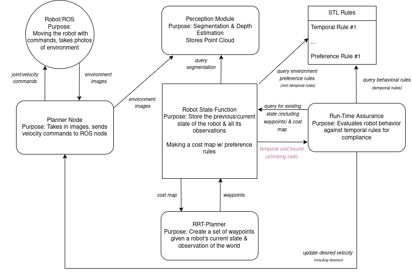

# From Language to Logic: VLM-Grounded Safe Navigation in Novel Environments

This repository contains code and resources for incorporating Signal Temporal Logic into a vision-based autonomous robot navigation system.

## Relevant Papers and Posters:
1. From Language to Logic: VLM-Grounded Safe Navigation in Novel Environments, HCSS 2026, accepted to poster session
2. From Language to Logic: A Theoretical Architecture for VLM-Grounded Safe Navigation, ICUAS 2026, pending 

## Members
- Kristy Sakano, at kvsakano[AT]umd.edu
- Kalonji Harring at kharring[AT]umd.edu
- Matthew Bandos, undergraduate research assistant
- Dr. Mumu Xu, at mumu[AT]umd.edu

## Overview

# Installation Instructions
This section details the installation process for this project.

## Docker  

WIP

## From Source

Install [ROS Galactic](https://docs.ros.org/en/galactic/Installation.html). This project makes use of rclpy, sensor_msgs, and and cv-bridge.  

We suggest creating a Python virtual environment before following the steps below.  

Install the project's requirements using pip
`pip install -r requirements.txt`

## Usage

Be sure that ROS has been activated either manually or through your shell's startup script

`source /opt/ros/galactic/setup.bash`  
